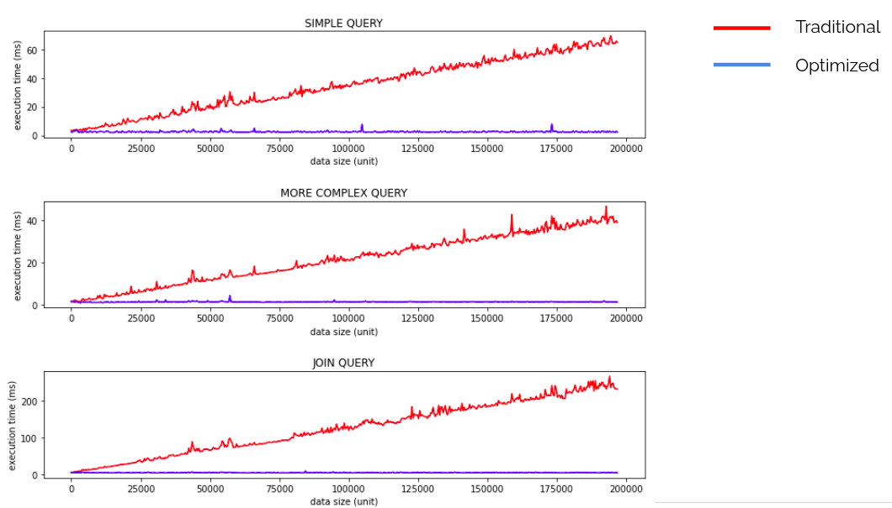
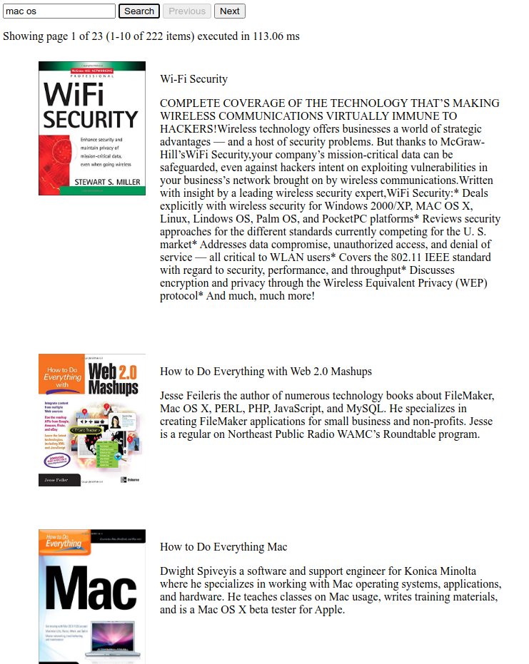
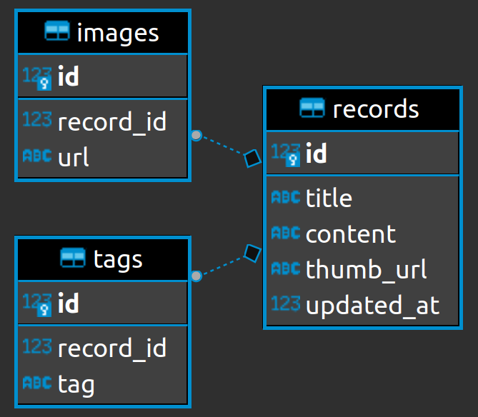
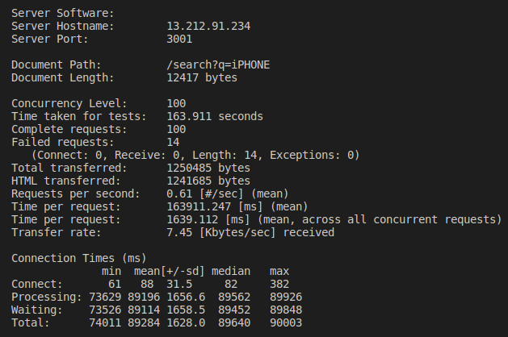
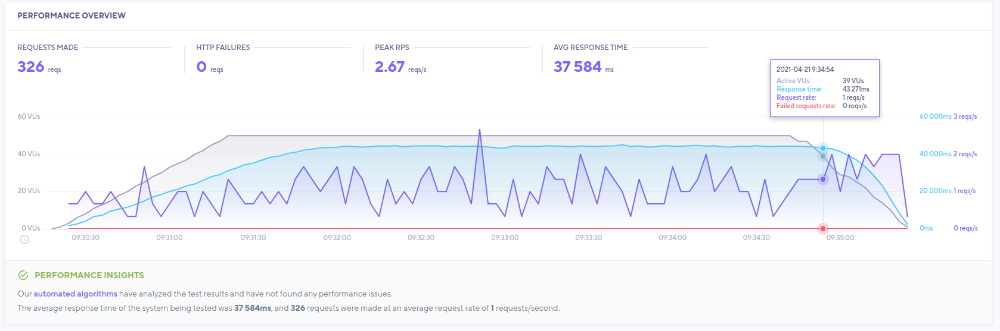
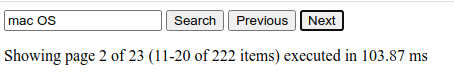

# KraickList

### Table of content

- Getting started
- Improvement
- Database diagram
- Load testing

## Getting started

Before building the project, pleae make sure to prepare your data first. If you are willing to just run using test data, rename the test data as following

```
cp test-data.gz data.gz
```

If you have the similar data format, kindly download it

```
wget <YOUR_LINK> -O data.gz
```

Once the data is set, build the data (using Docker for reproducibility)

```
docker build . -t "kraicklist"
```

Besides building, this Dockerfile is also doing the migration/transformation of our compressed data into sql databse.

If the build is done, let's run our application then.

```
docker run -d -p 3001:3001 kraicklist:latest
```

## Improvement

- Transform data into sql

If we are playing with a bunch of data, it's undebatable and best to use database (let's take sql as for now) instead create our own data object. This way we can utilize the sql power to query the user request in the most efficient form. For the sake of simplicity, I make use of sqlite3, so that we don't need to fire database instance in our tiny machine. But for real deployment, use battle tested database like postgresql (or other db) and always separate the worker instance and stateful instance. We should use the database for data storing and make our application remains stateless.

- Cursor based pagination

It is common to do pagination using offset based syntax as below

```
SELECT * FROM table WHERE something = "value" LIMIT 10 OFFSET 90
```

This approach actually has major drawback. This offset based query will perform fullscan table and make the query inefficient, considering we only want to have a smaller part of whole matched rows at a time.

So how do we do it better? Use cursor based pagination. Just tweak your script into

```
SELECT * FROM table WHERE something = "value" AND id > 90 LIMIT 10
```

Adding index on query will greatly improve the query because it won't undergo the fullscan table. Instead this query will jump into specified starting point, take as much data needed at a time, and result flat execution time regardless the data size.

For comparison



- Frontend (FE) improvement

Adding minor FE feature e.g. pagination, search result image, and search summary.



## Database diagram

The database design as following



## Load testing





Load testing was performed using k6.io and `ab`. The k6.io was testing with 50 concurrency, while `ab` with 100 concurrency. No request was failing on k6.io testing. As for `ab` there are 14 failed requests, these were caused by request time out. However, the server was not experiencing down time at all.

Considering the execution time excluding network transit timing, the time needed is under 500 ms (tested for 10 items per page).


